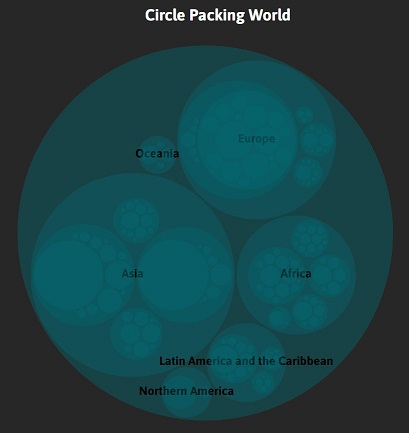
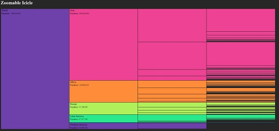
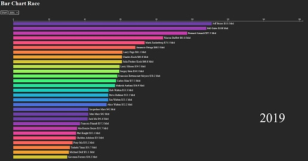
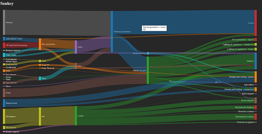
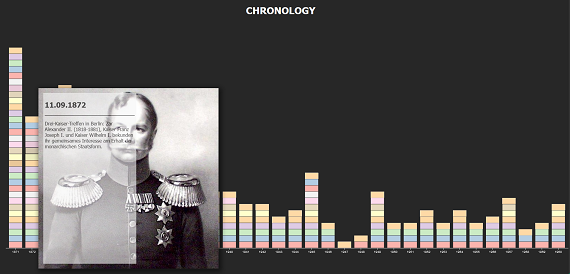

# 2021-swp-data-driven-document
A software project by bachelor students in the summer semester 2021. Further features for the IVOD project are implemented: Diagrams in D3 based on the architecture of the Pive project. 
# Problem and Solution
**Problem:**
- There is so much data in today's world of big data
- This data is as valuable as money
- Owning data and being able to translate it into BI are especially important in a highly competitive market
- But a person cannot do anything with a heap of data in the first place

**Solution:**
- The visualization of data is the solution and therefore the success factor in the context of digital information
- The key is to create infographics, charts and graphs to relate information and reveal patterns
# Circle Packing

- **Version:** [d3.v7](https://github.com/d3/d3/releases/tag/v7.0.0)
- **Data structure:** 
    - The data file should consist of at least two name:value-pairs.
        - The **"main": string** pair is setting the title of the data   
        - The **"children": array** pair is holding the values of the data
    - The array of the **"children": array** pair consists of objects with at least one name:value-pair.
        - The **"name": string** pair is holding the name of this Object
        - The **"value: number"** pair is holding the value of this Object
    - Each element of the **"value": number** pair can be replaced by a new **"children": array** pair to go deeper in structure.

[Example: data-structure CirclePacking](CirclePacking/data/dataWorldAndDE.json)

- **Interaktion:**
  - Users can click into the circles of the diagram to zoom in or out
  - Users can hover over the circles to get more informations (tooltip with name and value) 

# Zoomable Icicle

- **Version:** [d3.v5](https://github.com/d3/d3/releases/tag/v5.0.0)
- **Data structure:** 
    - The data file should consist of at least two name:value-pairs.
        - The **"main": string** pair is setting the title of the data   
        - The **"children": array** pair is holding the values of the data
    - The array of the **"children": array** pair consists of objects with at least one name:value-pair.
        - The **"name": string** pair is holding the name of this Object
        - The **"value: number"** pair is holding the value of this Object
    - Each element of the **"value": number** pair can be replaced by a new **"children": array** pair to go deeper in structure.

[Example: data-structure Zoomable Icicle](Zoomable%20Icicle/data/dataWorldAndDE.json)

- **Interaktion:**
    - Users can click on the elements to zoom in
    - Users can click on the left sided element to zoom out 

# Bar chart race

- **Version:** latest stable build [d3.v7](https://github.com/d3/d3/releases/tag/v7.0.0)
- **Data structure:** The JSON file consists only of arrays with three elements. 
    - Each array mus contain at least one Array including the attributes **name**, **date** and **value**.
    - The **name** is setting the description for the bar in the diagram.
    - The **date** should contain a specific year or month with year.
    - The **value** is responsible for the length of the bar. 

[Example: data-structure Bar chart race](Bar%20Chart%20Race/data/richestPeople.json)   
  
- **Interactions:**
    The diagram has two types of interaction. When you first visit the page, the diagram is not visible. By clicking on the “Start” button, the diagram runs through       all existing years and creates a bar chart. Furthermore, you have the option to display the individual years by the dropdown menu.
# Sankey

- **Version:** latest stable build [d3.v7](https://github.com/d3/d3/releases/tag/v7.0.0)
- **Data structure:** The data file should consist of two main arrays.
  - The **nodes** array, which contains the child nodes as objects, including the **index** attribute of type *int* and the **name** attribute of type *String*.
The **index** attribute must be set to arrange the nodes in the sankey. The **name** attribute assigns the corresponding name to the node and will be shown in the matching rect.
  - The **links** array, which contains the connections between each node. It consists of three attributes. The **source** and **target** attribute define the origin from which the link should start and the destination the link should lead to. Both are of type *int*. The **value** attribute defines the size or width of each link.

[Example: data-structure Sankey](Sankey/data/energy.json)

- **Interactions:**
  - Users can interact with each node. They are draggable and can be moved for better overview. 
  - Layout can be changed throgh a dropdown menu for other user requirements.

# Chronology

- **Version:** latest stable build [d3.v7](https://github.com/d3/d3/releases/tag/v7.0.0)
- **Data structure:** The data file should consist of at least one array.
  - Each array must have an unique name typed as *String*. It defines a bar and the corresponding X axis.
  - Each array must contain at least one Object including the attributes **Date**, **Desc**, **Picture** each one typed as *String*.
  - This array defines the stacked data inside the main bar defined by the parent array. Each array will result in a new stack block inside the main bar.
  - The  **Date** should contain a specific Date as a day or month.
  - The **Desc** can contain any description matching to the Date.
  - The **Picture** can contain a link reffering to a matching image you want to display.

[Example: data-structure Chronology](Chronology/data/germanHistory.json)

- **Interactions:**
  - Each stacked data has a hover ability. On hover there will appear a *div* as a tooltip including all data defined in the child array. The exact date, a description and if defined an image.

# externe Ressourcen
[D3JS](https://d3js.org/ "D3JS Homepage")

[D3 Lektüre, Versionsunterschiede beachten!](https://alignedleft.com/tutorials/d3 "Scott Murray D3 Tutorials")
